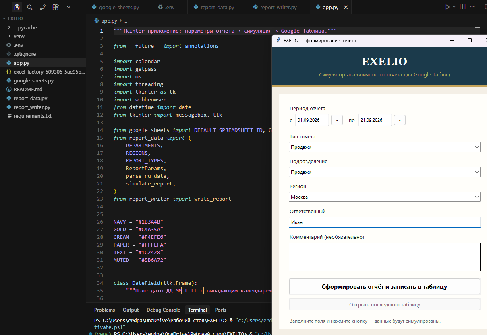
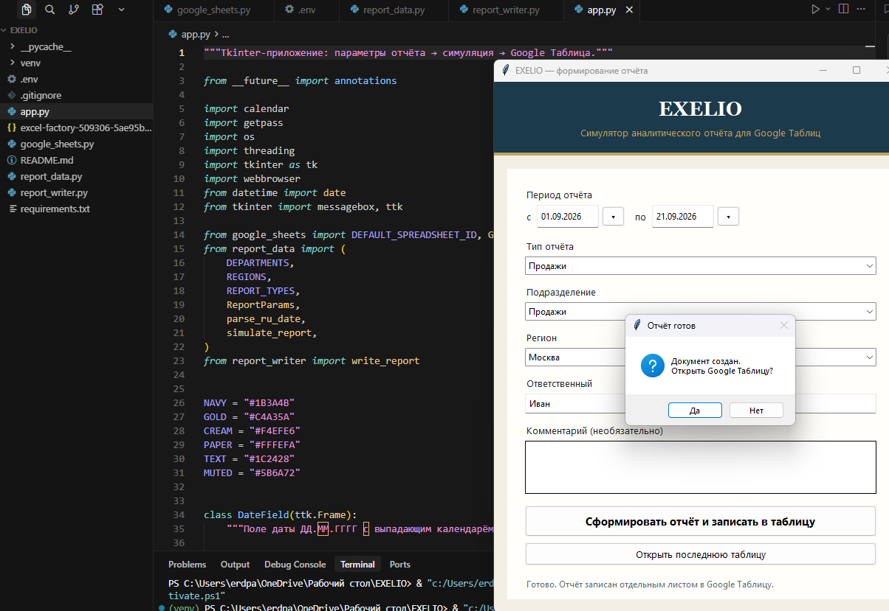
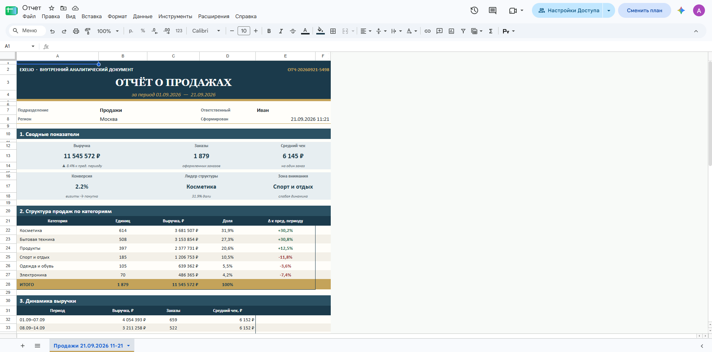

# EXELIO — автоматические отчёты в Google Таблицах

Небольшое приложение: в Tkinter задаёте период и пару полей, программа **симулирует** аналитический отчёт и записывает его в Google Таблицу как оформленный документ (шапка, KPI, таблицы, выводы), а не как сырой список ячеек.

## Возможности

- Симуляция **4 типов отчётов**: продажи, остатки, финансы, клиенты — по периоду, подразделению и региону.
- Оформление документа **на отдельном листе**: без сетки, с шапкой, блоками показателей, таблицами и выводами.
- Переиспользуемый **CRUD-клиент** Google Sheets (`GoogleSheetsClient`) для чтения, добавления, обновления и очистки ячеек.

## Скриншоты

 



## Установка

```bash
python -m venv venv
venv\Scripts\activate
pip install -r requirements.txt
```

## Настройка

1. JSON-ключ сервисного аккаунта лежит в корне проекта.
2. В Google Таблице выдайте доступ на **редактирование** email'у сервисного аккаунта (`client_email` из JSON).
3. ID таблицы по умолчанию уже прописан. При необходимости:

```powershell
$env:SPREADSHEET_ID = "ваш_id_таблицы"
$env:GOOGLE_CREDENTIALS_PATH = "excel-factory-509306-5ae95b8dd439.json"
```

## Переменные окружения

| Переменная | Описание |
|------------|----------|
| `SPREADSHEET_ID` | ID Google Таблицы |
| `SHEET_NAME` | Имя листа для `google_sheets.py` (иначе — первый лист) |
| `GOOGLE_CREDENTIALS_PATH` | Путь к JSON-ключу |

## Запуск приложения

```bash
python app.py
```

В форме укажите:

- период **с / по**
- тип отчёта (продажи, остатки, финансы, клиенты)
- подразделение и регион
- ответственного и необязательный комментарий

После кнопки «Сформировать» появится **новый лист** в таблице: без сетки, с шапкой, блоками показателей и таблицами.

## Проверка клиента таблиц

```bash
python google_sheets.py
```

Печатает содержимое активного листа в консоль.

## Использование клиента в коде

```python
from google_sheets import GoogleSheetsClient

sheets = GoogleSheetsClient(
    spreadsheet_id="YOUR_SPREADSHEET_ID",
    credentials_path="excel-factory-509306-5ae95b8dd439.json",
)

rows = sheets.read_all()
sheets.append([["имя", "email", "статус"]])
sheets.update("A2:C2", [["Иван", "ivan@example.com", "ok"]])
sheets.clear("A2:D2")
```

## Архитектура

| Файл | Назначение |
|------|------------|
| `app.py` | Окно Tkinter |
| `report_data.py` | Симуляция показателей |
| `report_writer.py` | Вёрстка документа в таблице |
| `google_sheets.py` | Клиент Google Sheets API |
| `requirements.txt` | Зависимости |
| `*.json` | Ключ сервисного аккаунта (не коммитить) |

## Автор

Павел Эрдниев · Telegram [@Erdpav](https://t.me/Erdpav) · GitHub [erdpav-cmd](https://github.com/erdpav-cmd)
